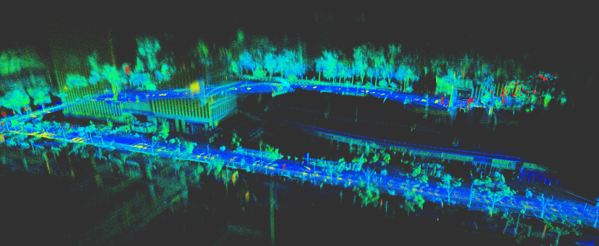

# LINS-LIVOX

### 一个基于迭代误差状态卡尔曼滤波(IESKF)的Livox-IMU车载SLAM系统实现




将[LINS---LiDAR-inertial-SLAM](https://github.com/ChaoqinRobotics/LINS---LiDAR-inertial-SLAM)的思路迁移到大疆Livox Horizon激光雷达上，从而实现轻量化的激光SLAM系统。

- [x] 地面提取

  由于livox的点云不像传统旋转式机械激光雷达那样规则分布，因此我们采用[Run_based_segmentation](https://github.com/VincentCheungM/Run_based_segmentation)的地平面拟合方法进行地面提取。

- [x] 前端里程计关于 `pitch`，`roll`以及 `tz`的计算

  我们之前花了较大力气进行地面拟合和提取，得到较为准确的地面的平面方程。所以在前端部分直接通过两次扫描的地面方程进行 `pitch`，`roll`以及 `tz`的计算，然后与IMU测量进行一次互补滤波。

- [x] 使用右扰动模型推导ICP配准的雅克比

  LOAM和lego-loam中，关于旋转的求导相信让很多朋友困惑了很久。因此，在本项目中我们采用右扰动模型进行旋转求导。从建图效果上可以表明理论上的数学推导是没问题的，剩下的就是精度问题。

- [x] 回环检测

  在后端部分已经构建好基于ISAM2的位姿图优化框架。后续会加上回环检测，已经使用基于里程计的回环检测与校正。后续计划使用[scancontext](https://github.com/irapkaist/scancontext)实现回环检测。

- [x] 基于IESKF的LiDAR-Inertial odometry

  参考LINS设计一个迭代误差状态卡尔曼滤波器，用于估计前端里程计中的`yaw`, `tx`和`ty`。具体实现过程可见代码，但是代码实现可能有点繁琐。

**注：由于采用了地面提取并将地面应用于估计前端里程计，因此默认Livox与车体平行，即Livox与地面平行（或者已知Livox与车体直接的装配角度）。所以它与LEGO-LOAM一样，仅适用于车辆，不适用于手持测绘。**

### 1. 编译

依赖：

* **Ubuntu 18.04** and**ROS melodic**
* **PCL 1.9**
* **Eigen 3.3.7**
* **[livox_ros_driver](https://github.com/Livox-SDK/livox_ros_driver)**
* **GTSAM 4.1**

```
cd ~/ros/catkin_ws/src
git clone https://github.com/GDUT-Kyle/LINS-LIVOX.git
cd ../
catkin build LINS_livox
source devel/setup.bash
```

### 2. rosbag测试

由于不确定自己录制的数据包能否传播（没有测绘资质），建议下载Livox官方提供的数据包[parking lot rosbag](https://terra-1-g.djicdn.com/65c028cd298f4669a7f0e40e50ba1131/demo/2020_parking_lot.bag)进行测试

```
roslaunch lins_livox lins_slam.launch
rosbag play 2020_parking_lot.bag --clock
```

### 3. 实时测试

```
roslaunch livox_ros_driver livox_lidar_msg.launch
roslaunch lego_livox lins_slam.launch
```

**广东工业大学校园测绘结果1（树木密集场景）——[视频]()**


**广东工业大学校园测绘结果2（带回环场景）——[视频]()**


### 5. 参考资料

[LINS---LiDAR-inertial-SLAM](https://github.com/ChaoqinRobotics/LINS---LiDAR-inertial-SLAM)

[livox_horizon_loam](https://github.com/Livox-SDK/livox_horizon_loam)

[LeGO-LOAM](https://github.com/RobustFieldAutonomyLab/LeGO-LOAM)

[Run_based_segmentation](https://github.com/VincentCheungM/Run_based_segmentation)

《视觉SLAM十四讲：从理论到实践》

本人博客：https://blog.csdn.net/m0_38144614?spm=1001.2014.3001.5343

### 6. 致谢

https://blog.mchook.cn/

https://blog.csdn.net/Kamfai_Row?spm=1001.2014.3001.5509
